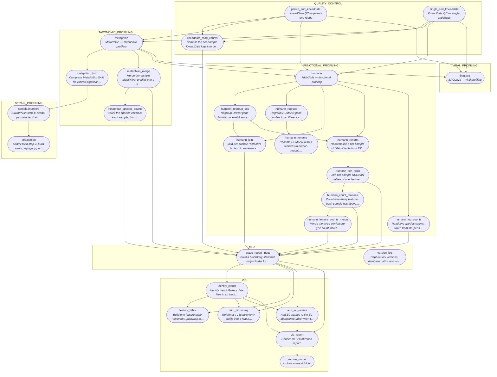
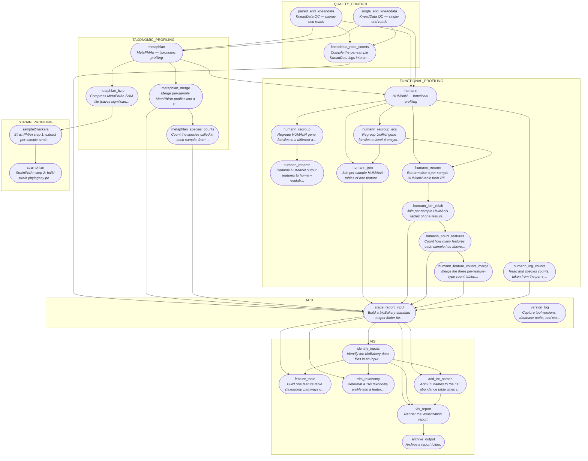
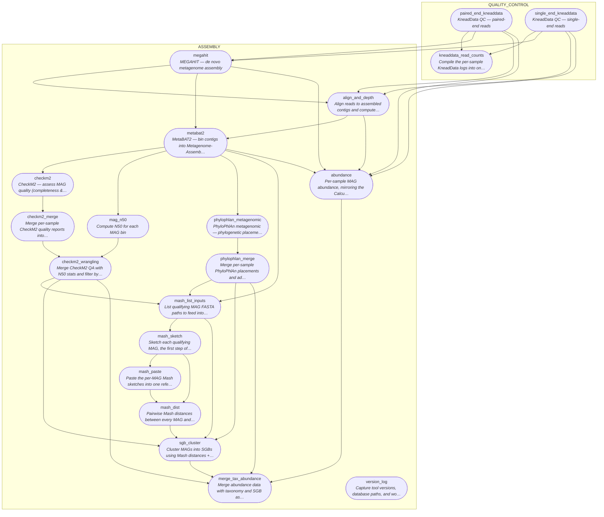
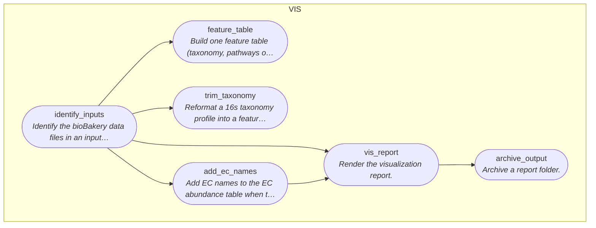
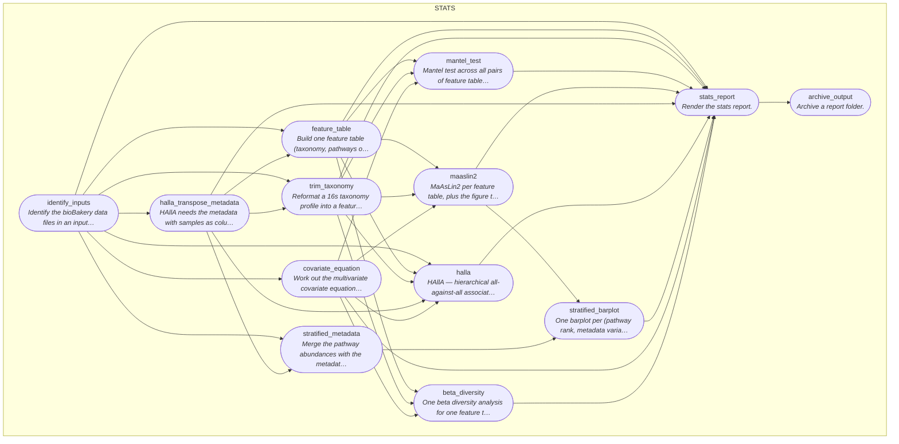

# Workflow reference

**Generated — do not edit.** Regenerate with `bin/make_diagrams.py`;
CI checks this file with `bin/make_diagrams.py --check`.

Every diagram is Nextflow's own DAG for that workflow, taken from
`nextflow run -preview -with-dag`, with the value-channel and operator
nodes contracted away so only the steps remain. Boxes are grouped by the
subworkflow they live in. Each step's description is the comment above its
`process` in `modules/`.

Optional stages that are off by default (`--run_viral_profiling`,
`--run_strain_profiling`) are drawn as if enabled, so the diagram shows
everything a workflow can do.

| Workflow | `--workflow` | What it does | Steps |
|---|---|---|---|
| [mgx](#mgx) | `mgx` | Whole metagenome shotgun | 28 |
| [mtx](#mtx) | `mtx` | Whole metatranscriptome shotgun | 27 |
| [mgx_mtx](#mgx_mtx) | `mgx_mtx` | Paired metagenome + metatranscriptome | 28 |
| [assembly](#assembly) | `assembly` | MAG assembly, binning and SGB clustering | 20 |
| [vis](#vis) | `vis` | Visualisation report | 6 |
| [stats](#stats) | `stats` | Statistical analysis report | 13 |

## mgx

Whole metagenome shotgun.

| Step | What it does | Defined in | Publishes to |
|---|---|---|---|
| `add_ec_names` | Add EC names to the EC abundance table when they are missing. | `modules/vis/add_ec_names/main.nf` | `<outdir>/vis/ecs` |
| `archive_output` | Archive a report folder. | `modules/utils/archive/main.nf` | `<outdir>` |
| `baqlava` | BAQLaVa — viral profiling | `modules/viral/baqlava/main.nf` | `<outdir>/baqlava` |
| `feature_table` | Build one feature table (taxonomy, pathways or any other data file). | `modules/stats/feature_table/main.nf` | `<outdir>/stats/features` |
| `humann` | HUMAnN — functional profiling | `modules/humann/main.nf` | `<outdir>/<subdir>humann/<params.humann_version>/main` |
| `humann_count_features` | Count how many features each sample has above zero, per feature type. | `modules/utils/humann_merge/main.nf` | `<outdir>/<subdir>humann/<params.humann_version>/counts` |
| `humann_feature_counts_merge` | Merge the three per-feature-type count tables into one | `modules/utils/humann_merge/main.nf` | `<outdir>/<subdir>humann/<params.humann_version>/counts` |
| `humann_join` | Join per-sample HUMAnN tables of one feature type into a single matrix. | `modules/utils/humann_merge/main.nf` | `<outdir>/<subdir>humann/<params.humann_version>/merged` |
| `humann_join_relab` | Join per-sample HUMAnN tables of one feature type into a single matrix. (`humann_join`, run again as `humann_join_relab`) | `modules/utils/humann_merge/main.nf` | `<outdir>/<subdir>humann/<params.humann_version>/merged` |
| `humann_log_counts` | Read and species counts, taken from the per-sample HUMAnN logs. | `modules/utils/humann_merge/main.nf` | `<outdir>/<subdir>humann/<params.humann_version>/counts` |
| `humann_regroup` | Regroup HUMAnN gene families to a different annotation scheme. | `modules/utils/humann_regroup/main.nf` | `<outdir>/<subdir>humann/<params.humann_version>/regrouped` |
| `humann_regroup_ecs` | Regroup UniRef gene families to level-4 enzyme commission numbers. | `modules/utils/humann_regroup/main.nf` | `<outdir>/<subdir>humann/<params.humann_version>/regrouped` |
| `humann_rename` | Rename HUMAnN output features to human-readable names | `modules/utils/humann_rename/main.nf` | `<outdir>/<subdir>humann/<params.humann_version>/renamed` |
| `humann_renorm` | Renormalise a per-sample HUMAnN table from RPK to relative abundance. | `modules/utils/humann_renorm/main.nf` | `<outdir>/<subdir>humann/<params.humann_version>/relab/<feature>` |
| `identify_inputs` | Identify the bioBakery data files in an input folder. | `modules/vis/identify_inputs/main.nf` | `<outdir>/<report_type>` |
| `kneaddata_read_counts` | Compile the per-sample KneadData logs into one read count table. | `modules/kneaddata/main.nf` | `<outdir>/<subdir>kneaddata/merged` |
| `metaphlan` | MetaPhlAn — taxonomic profiling | `modules/metaphlan/main.nf` | `<outdir>/<subdir>metaphlan/<params.metaphlan_index>` |
| `metaphlan_bzip` | Compress MetaPhlAn SAM file (saves significant disk space) | `modules/metaphlan/main.nf` | `<outdir>/<subdir>metaphlan/bzip` |
| `metaphlan_merge` | Merge per-sample MetaPhlAn profiles into a single table | `modules/metaphlan/main.nf` | `<outdir>/<subdir>metaphlan` |
| `metaphlan_species_counts` | Count the species called in each sample, from the merged profile. | `modules/metaphlan/main.nf` | `<outdir>/<subdir>metaphlan/merged` |
| `paired_end_kneaddata` | KneadData QC — paired-end reads | `modules/kneaddata/main.nf` | `<outdir>/<subdir>kneaddata` |
| `sample2markers` | StrainPhlAn step 1: extract per-sample strain markers from MetaPhlAn SAM output | `modules/strainphlan/main.nf` | `<outdir>/strainphlan/markers` |
| `single_end_kneaddata` | KneadData QC — single-end reads | `modules/kneaddata/main.nf` | `<outdir>/<subdir>kneaddata` |
| `stage_report_input` | Build a bioBakery-standard output folder for vis and stats to read. | `modules/utils/report_input/main.nf` | `<outdir>` |
| `strainphlan` | StrainPhlAn step 2: build strain phylogeny per clade | `modules/strainphlan/main.nf` | `<outdir>/strainphlan/<clade>` |
| `trim_taxonomy` | Reformat a 16s taxonomy profile into a feature table. | `modules/stats/feature_table/main.nf` | `<outdir>/stats/features` |
| `version_log` | Capture tool versions, database paths, and workflow parameters for reproducibility | `modules/utils/version_log/main.nf` | `<outdir>/pipeline_info` |
| `vis_report` | Render the visualization report. | `modules/vis/report/main.nf` | `<outdir>` |

## mtx

Whole metatranscriptome shotgun.

| Step | What it does | Defined in | Publishes to |
|---|---|---|---|
| `add_ec_names` | Add EC names to the EC abundance table when they are missing. | `modules/vis/add_ec_names/main.nf` | `<outdir>/vis/ecs` |
| `archive_output` | Archive a report folder. | `modules/utils/archive/main.nf` | `<outdir>` |
| `feature_table` | Build one feature table (taxonomy, pathways or any other data file). | `modules/stats/feature_table/main.nf` | `<outdir>/stats/features` |
| `humann` | HUMAnN — functional profiling | `modules/humann/main.nf` | `<outdir>/<subdir>humann/<params.humann_version>/main` |
| `humann_count_features` | Count how many features each sample has above zero, per feature type. | `modules/utils/humann_merge/main.nf` | `<outdir>/<subdir>humann/<params.humann_version>/counts` |
| `humann_feature_counts_merge` | Merge the three per-feature-type count tables into one | `modules/utils/humann_merge/main.nf` | `<outdir>/<subdir>humann/<params.humann_version>/counts` |
| `humann_join` | Join per-sample HUMAnN tables of one feature type into a single matrix. | `modules/utils/humann_merge/main.nf` | `<outdir>/<subdir>humann/<params.humann_version>/merged` |
| `humann_join_relab` | Join per-sample HUMAnN tables of one feature type into a single matrix. (`humann_join`, run again as `humann_join_relab`) | `modules/utils/humann_merge/main.nf` | `<outdir>/<subdir>humann/<params.humann_version>/merged` |
| `humann_log_counts` | Read and species counts, taken from the per-sample HUMAnN logs. | `modules/utils/humann_merge/main.nf` | `<outdir>/<subdir>humann/<params.humann_version>/counts` |
| `humann_regroup` | Regroup HUMAnN gene families to a different annotation scheme. | `modules/utils/humann_regroup/main.nf` | `<outdir>/<subdir>humann/<params.humann_version>/regrouped` |
| `humann_regroup_ecs` | Regroup UniRef gene families to level-4 enzyme commission numbers. | `modules/utils/humann_regroup/main.nf` | `<outdir>/<subdir>humann/<params.humann_version>/regrouped` |
| `humann_rename` | Rename HUMAnN output features to human-readable names | `modules/utils/humann_rename/main.nf` | `<outdir>/<subdir>humann/<params.humann_version>/renamed` |
| `humann_renorm` | Renormalise a per-sample HUMAnN table from RPK to relative abundance. | `modules/utils/humann_renorm/main.nf` | `<outdir>/<subdir>humann/<params.humann_version>/relab/<feature>` |
| `identify_inputs` | Identify the bioBakery data files in an input folder. | `modules/vis/identify_inputs/main.nf` | `<outdir>/<report_type>` |
| `kneaddata_read_counts` | Compile the per-sample KneadData logs into one read count table. | `modules/kneaddata/main.nf` | `<outdir>/<subdir>kneaddata/merged` |
| `metaphlan` | MetaPhlAn — taxonomic profiling | `modules/metaphlan/main.nf` | `<outdir>/<subdir>metaphlan/<params.metaphlan_index>` |
| `metaphlan_bzip` | Compress MetaPhlAn SAM file (saves significant disk space) | `modules/metaphlan/main.nf` | `<outdir>/<subdir>metaphlan/bzip` |
| `metaphlan_merge` | Merge per-sample MetaPhlAn profiles into a single table | `modules/metaphlan/main.nf` | `<outdir>/<subdir>metaphlan` |
| `metaphlan_species_counts` | Count the species called in each sample, from the merged profile. | `modules/metaphlan/main.nf` | `<outdir>/<subdir>metaphlan/merged` |
| `paired_end_kneaddata` | KneadData QC — paired-end reads | `modules/kneaddata/main.nf` | `<outdir>/<subdir>kneaddata` |
| `sample2markers` | StrainPhlAn step 1: extract per-sample strain markers from MetaPhlAn SAM output | `modules/strainphlan/main.nf` | `<outdir>/strainphlan/markers` |
| `single_end_kneaddata` | KneadData QC — single-end reads | `modules/kneaddata/main.nf` | `<outdir>/<subdir>kneaddata` |
| `stage_report_input` | Build a bioBakery-standard output folder for vis and stats to read. | `modules/utils/report_input/main.nf` | `<outdir>` |
| `strainphlan` | StrainPhlAn step 2: build strain phylogeny per clade | `modules/strainphlan/main.nf` | `<outdir>/strainphlan/<clade>` |
| `trim_taxonomy` | Reformat a 16s taxonomy profile into a feature table. | `modules/stats/feature_table/main.nf` | `<outdir>/stats/features` |
| `version_log` | Capture tool versions, database paths, and workflow parameters for reproducibility | `modules/utils/version_log/main.nf` | `<outdir>/pipeline_info` |
| `vis_report` | Render the visualization report. | `modules/vis/report/main.nf` | `<outdir>` |

## mgx_mtx

Paired metagenome + metatranscriptome.

```mermaid
flowchart TB
    subgraph QC_MGX
        v10(["paired_end_kneaddata<br/><i>KneadData QC — paired-end reads</i>"])
        v13(["single_end_kneaddata<br/><i>KneadData QC — single-end reads</i>"])
        v22(["kneaddata_read_counts<br/><i>Compile the per-sample KneadData logs into on…</i>"])
    end
    subgraph QC_MTX
        v34(["paired_end_kneaddata<br/><i>KneadData QC — paired-end reads</i>"])
        v37(["single_end_kneaddata<br/><i>KneadData QC — single-end reads</i>"])
        v46(["kneaddata_read_counts<br/><i>Compile the per-sample KneadData logs into on…</i>"])
    end
    subgraph TAX_MGX
        v55(["metaphlan<br/><i>MetaPhlAn — taxonomic profiling</i>"])
        v58(["metaphlan_bzip<br/><i>Compress MetaPhlAn SAM file (saves significan…</i>"])
        v62(["metaphlan_merge<br/><i>Merge per-sample MetaPhlAn profiles into a si…</i>"])
        v64(["metaphlan_species_counts<br/><i>Count the species called in each sample, from…</i>"])
    end
    subgraph TAX_MTX
        v67(["metaphlan<br/><i>MetaPhlAn — taxonomic profiling</i>"])
        v70(["metaphlan_bzip<br/><i>Compress MetaPhlAn SAM file (saves significan…</i>"])
        v75(["metaphlan_merge<br/><i>Merge per-sample MetaPhlAn profiles into a si…</i>"])
        v77(["metaphlan_species_counts<br/><i>Count the species called in each sample, from…</i>"])
    end
    subgraph FUNC_MGX
        v84(["humann<br/><i>HUMAnN — functional profiling</i>"])
        v88(["humann_regroup_ecs<br/><i>Regroup UniRef gene families to level-4 enzym…</i>"])
        v90(["humann_regroup<br/><i>Regroup HUMAnN gene families to a different a…</i>"])
        v92(["humann_rename<br/><i>Rename HUMAnN output features to human-readab…</i>"])
        v102(["humann_join<br/><i>Join per-sample HUMAnN tables of one feature…</i>"])
        v104(["humann_renorm<br/><i>Renormalise a per-sample HUMAnN table from RP…</i>"])
        v108(["humann_join_relab<br/><i>Join per-sample HUMAnN tables of one feature…</i>"])
        v111(["humann_count_features<br/><i>Count how many features each sample has above…</i>"])
        v115(["humann_feature_counts_merge<br/><i>Merge the three per-feature-type count tables…</i>"])
        v120(["humann_log_counts<br/><i>Read and species counts, taken from the per-s…</i>"])
    end
    subgraph FUNC_MTX
        v138(["humann<br/><i>HUMAnN — functional profiling</i>"])
        v142(["humann_regroup_ecs<br/><i>Regroup UniRef gene families to level-4 enzym…</i>"])
        v144(["humann_regroup<br/><i>Regroup HUMAnN gene families to a different a…</i>"])
        v146(["humann_rename<br/><i>Rename HUMAnN output features to human-readab…</i>"])
        v156(["humann_join<br/><i>Join per-sample HUMAnN tables of one feature…</i>"])
        v158(["humann_renorm<br/><i>Renormalise a per-sample HUMAnN table from RP…</i>"])
        v162(["humann_join_relab<br/><i>Join per-sample HUMAnN tables of one feature…</i>"])
        v165(["humann_count_features<br/><i>Count how many features each sample has above…</i>"])
        v169(["humann_feature_counts_merge<br/><i>Merge the three per-feature-type count tables…</i>"])
        v174(["humann_log_counts<br/><i>Read and species counts, taken from the per-s…</i>"])
    end
    subgraph MGX_MTX
        v201(["rna_dna_norm<br/><i>RNA/DNA relative expression ratio for one fea…</i>"])
        v217(["stage_report_input<br/><i>Build a bioBakery-standard output folder for…</i>"])
        v243(["version_log<br/><i>Capture tool versions, database paths, and wo…</i>"])
    end
    subgraph STRAIN_PROFILING
        v205(["sample2markers<br/><i>StrainPhlAn step 1: extract per-sample strain…</i>"])
        v210(["strainphlan<br/><i>StrainPhlAn step 2: build strain phylogeny pe…</i>"])
    end
    subgraph VIS
        v220(["identify_inputs<br/><i>Identify the bioBakery data files in an input…</i>"])
        v228(["feature_table<br/><i>Build one feature table (taxonomy, pathways o…</i>"])
        v229(["trim_taxonomy<br/><i>Reformat a 16s taxonomy profile into a featur…</i>"])
        v235(["add_ec_names<br/><i>Add EC names to the EC abundance table when t…</i>"])
        v238(["vis_report<br/><i>Render the visualization report.</i>"])
        v241(["archive_output<br/><i>Archive a report folder.</i>"])
    end

    v10 --> v22
    v10 --> v55
    v10 --> v84
    v13 --> v22
    v13 --> v55
    v13 --> v84
    v22 --> v217
    v34 --> v46
    v34 --> v67
    v34 --> v138
    v37 --> v46
    v37 --> v67
    v37 --> v138
    v55 --> v58
    v55 --> v62
    v55 --> v84
    v58 --> v205
    v62 --> v64
    v62 --> v217
    v64 --> v217
    v67 --> v70
    v67 --> v75
    v67 --> v138
    v75 --> v77
    v84 --> v88
    v84 --> v90
    v84 --> v102
    v84 --> v104
    v84 --> v120
    v88 --> v102
    v88 --> v104
    v90 --> v92
    v102 --> v201
    v102 --> v217
    v104 --> v108
    v108 --> v111
    v108 --> v217
    v111 --> v115
    v111 --> v217
    v115 --> v217
    v120 --> v217
    v138 --> v142
    v138 --> v144
    v138 --> v156
    v138 --> v158
    v138 --> v174
    v142 --> v156
    v142 --> v158
    v144 --> v146
    v156 --> v201
    v158 --> v162
    v162 --> v165
    v165 --> v169
    v205 --> v210
    v217 --> v220
    v217 --> v228
    v217 --> v229
    v217 --> v235
    v217 --> v238
    v220 --> v228
    v220 --> v229
    v220 --> v235
    v220 --> v238
    v235 --> v238
    v238 --> v241
```

| Step | What it does | Defined in | Publishes to |
|---|---|---|---|
| `add_ec_names` | Add EC names to the EC abundance table when they are missing. | `modules/vis/add_ec_names/main.nf` | `<outdir>/vis/ecs` |
| `archive_output` | Archive a report folder. | `modules/utils/archive/main.nf` | `<outdir>` |
| `feature_table` | Build one feature table (taxonomy, pathways or any other data file). | `modules/stats/feature_table/main.nf` | `<outdir>/stats/features` |
| `humann` | HUMAnN — functional profiling | `modules/humann/main.nf` | `<outdir>/<subdir>humann/<params.humann_version>/main` |
| `humann_count_features` | Count how many features each sample has above zero, per feature type. | `modules/utils/humann_merge/main.nf` | `<outdir>/<subdir>humann/<params.humann_version>/counts` |
| `humann_feature_counts_merge` | Merge the three per-feature-type count tables into one | `modules/utils/humann_merge/main.nf` | `<outdir>/<subdir>humann/<params.humann_version>/counts` |
| `humann_join` | Join per-sample HUMAnN tables of one feature type into a single matrix. | `modules/utils/humann_merge/main.nf` | `<outdir>/<subdir>humann/<params.humann_version>/merged` |
| `humann_join_relab` | Join per-sample HUMAnN tables of one feature type into a single matrix. (`humann_join`, run again as `humann_join_relab`) | `modules/utils/humann_merge/main.nf` | `<outdir>/<subdir>humann/<params.humann_version>/merged` |
| `humann_log_counts` | Read and species counts, taken from the per-sample HUMAnN logs. | `modules/utils/humann_merge/main.nf` | `<outdir>/<subdir>humann/<params.humann_version>/counts` |
| `humann_regroup` | Regroup HUMAnN gene families to a different annotation scheme. | `modules/utils/humann_regroup/main.nf` | `<outdir>/<subdir>humann/<params.humann_version>/regrouped` |
| `humann_regroup_ecs` | Regroup UniRef gene families to level-4 enzyme commission numbers. | `modules/utils/humann_regroup/main.nf` | `<outdir>/<subdir>humann/<params.humann_version>/regrouped` |
| `humann_rename` | Rename HUMAnN output features to human-readable names | `modules/utils/humann_rename/main.nf` | `<outdir>/<subdir>humann/<params.humann_version>/renamed` |
| `humann_renorm` | Renormalise a per-sample HUMAnN table from RPK to relative abundance. | `modules/utils/humann_renorm/main.nf` | `<outdir>/<subdir>humann/<params.humann_version>/relab/<feature>` |
| `identify_inputs` | Identify the bioBakery data files in an input folder. | `modules/vis/identify_inputs/main.nf` | `<outdir>/<report_type>` |
| `kneaddata_read_counts` | Compile the per-sample KneadData logs into one read count table. | `modules/kneaddata/main.nf` | `<outdir>/<subdir>kneaddata/merged` |
| `metaphlan` | MetaPhlAn — taxonomic profiling | `modules/metaphlan/main.nf` | `<outdir>/<subdir>metaphlan/<params.metaphlan_index>` |
| `metaphlan_bzip` | Compress MetaPhlAn SAM file (saves significant disk space) | `modules/metaphlan/main.nf` | `<outdir>/<subdir>metaphlan/bzip` |
| `metaphlan_merge` | Merge per-sample MetaPhlAn profiles into a single table | `modules/metaphlan/main.nf` | `<outdir>/<subdir>metaphlan` |
| `metaphlan_species_counts` | Count the species called in each sample, from the merged profile. | `modules/metaphlan/main.nf` | `<outdir>/<subdir>metaphlan/merged` |
| `paired_end_kneaddata` | KneadData QC — paired-end reads | `modules/kneaddata/main.nf` | `<outdir>/<subdir>kneaddata` |
| `rna_dna_norm` | RNA/DNA relative expression ratio for one feature type. | `modules/utils/rna_dna_norm/main.nf` | `<outdir>/humann/rna_dna_norm` |
| `sample2markers` | StrainPhlAn step 1: extract per-sample strain markers from MetaPhlAn SAM output | `modules/strainphlan/main.nf` | `<outdir>/strainphlan/markers` |
| `single_end_kneaddata` | KneadData QC — single-end reads | `modules/kneaddata/main.nf` | `<outdir>/<subdir>kneaddata` |
| `stage_report_input` | Build a bioBakery-standard output folder for vis and stats to read. | `modules/utils/report_input/main.nf` | `<outdir>` |
| `strainphlan` | StrainPhlAn step 2: build strain phylogeny per clade | `modules/strainphlan/main.nf` | `<outdir>/strainphlan/<clade>` |
| `trim_taxonomy` | Reformat a 16s taxonomy profile into a feature table. | `modules/stats/feature_table/main.nf` | `<outdir>/stats/features` |
| `version_log` | Capture tool versions, database paths, and workflow parameters for reproducibility | `modules/utils/version_log/main.nf` | `<outdir>/pipeline_info` |
| `vis_report` | Render the visualization report. | `modules/vis/report/main.nf` | `<outdir>` |

## assembly

MAG assembly, binning and SGB clustering.

| Step | What it does | Defined in | Publishes to |
|---|---|---|---|
| `abundance` | Per-sample MAG abundance, mirroring the "Calculate by-sample abundance" task of | `modules/utils/abundance/main.nf` | `<outdir>/abundance_<params.sgb_abundance_type>` |
| `align_and_depth` | Align reads to assembled contigs and compute contig depth with jgi_summarize_bam_contig_depths | `modules/utils/align_and_depth/main.nf` | `<outdir>/assembly/contig_depths` |
| `checkm2` | CheckM2 — assess MAG quality (completeness & contamination) | `modules/qc/checkm2/main.nf` | `<outdir>/checkm/<sample>` |
| `checkm2_merge` | Merge per-sample CheckM2 quality reports into one table | `modules/qc/checkm2/main.nf` | `<outdir>/checkm` |
| `checkm2_wrangling` | Merge CheckM2 QA with N50 stats and filter by completeness/contamination thresholds | `modules/qc/checkm2/main.nf` | `<outdir>/checkm/qa` |
| `kneaddata_read_counts` | Compile the per-sample KneadData logs into one read count table. | `modules/kneaddata/main.nf` | `<outdir>/<subdir>kneaddata/merged` |
| `mag_n50` | Compute N50 for each MAG bin | `modules/qc/checkm2/main.nf` | `<outdir>/checkm/n50` |
| `mash_dist` | Pairwise Mash distances between every MAG and the reference sketch. | `modules/utils/mash/main.nf` | `<outdir>/sgbs/mash` |
| `mash_list_inputs` | List qualifying MAG FASTA paths to feed into Mash | `modules/utils/mash/main.nf` | `<outdir>/sgbs/mash` |
| `mash_paste` | Paste the per-MAG Mash sketches into one reference sketch. | `modules/utils/mash/main.nf` | `<outdir>/sgbs/mash` |
| `mash_sketch` | Sketch each qualifying MAG, the first step of the Mash distance pipeline. | `modules/utils/mash/main.nf` | `<outdir>/sgbs/mash` |
| `megahit` | MEGAHIT — de novo metagenome assembly | `modules/assembly/megahit/main.nf` | `<outdir>/assembly/main/<sample>` |
| `merge_tax_abundance` | Merge abundance data with taxonomy and SGB assignments into the final profile | `modules/utils/mash/main.nf` | `<outdir>` |
| `metabat2` | MetaBAT2 — bin contigs into Metagenome-Assembled Genomes (MAGs) | `modules/binning/metabat2/main.nf` | `<outdir>/bins/<sample>` |
| `paired_end_kneaddata` | KneadData QC — paired-end reads | `modules/kneaddata/main.nf` | `<outdir>/<subdir>kneaddata` |
| `phylophlan_merge` | Merge per-sample PhyloPhlAn placements and add taxonomic labels | `modules/phylogenomics/phylophlan_metagenomic/main.nf` | `<outdir>/phylophlan` |
| `phylophlan_metagenomic` | PhyloPhlAn metagenomic — phylogenetic placement of MAGs to nearest SGBs/GGBs/FGBs | `modules/phylogenomics/phylophlan_metagenomic/main.nf` | `<outdir>/phylophlan/<sample>` |
| `sgb_cluster` | Cluster MAGs into SGBs using Mash distances + CheckM/PhyloPhlAn metadata | `modules/utils/mash/main.nf` | `<outdir>/sgbs/sgbs` |
| `single_end_kneaddata` | KneadData QC — single-end reads | `modules/kneaddata/main.nf` | `<outdir>/<subdir>kneaddata` |
| `version_log` | Capture tool versions, database paths, and workflow parameters for reproducibility | `modules/utils/version_log/main.nf` | `<outdir>/pipeline_info` |

## vis

Visualisation report.

| Step | What it does | Defined in | Publishes to |
|---|---|---|---|
| `add_ec_names` | Add EC names to the EC abundance table when they are missing. | `modules/vis/add_ec_names/main.nf` | `<outdir>/vis/ecs` |
| `archive_output` | Archive a report folder. | `modules/utils/archive/main.nf` | `<outdir>` |
| `feature_table` | Build one feature table (taxonomy, pathways or any other data file). | `modules/stats/feature_table/main.nf` | `<outdir>/stats/features` |
| `identify_inputs` | Identify the bioBakery data files in an input folder. | `modules/vis/identify_inputs/main.nf` | `<outdir>/<report_type>` |
| `trim_taxonomy` | Reformat a 16s taxonomy profile into a feature table. | `modules/stats/feature_table/main.nf` | `<outdir>/stats/features` |
| `vis_report` | Render the visualization report. | `modules/vis/report/main.nf` | `<outdir>` |

## stats

Statistical analysis report.

| Step | What it does | Defined in | Publishes to |
|---|---|---|---|
| `archive_output` | Archive a report folder. | `modules/utils/archive/main.nf` | `<outdir>` |
| `beta_diversity` | One beta diversity analysis for one feature table. | `modules/stats/beta_diversity/main.nf` | `<outdir>/stats/beta_diversity` |
| `covariate_equation` | Work out the multivariate covariate equation for the beta diversity models. | `modules/stats/covariate_equation/main.nf` | `<outdir>/stats` |
| `feature_table` | Build one feature table (taxonomy, pathways or any other data file). | `modules/stats/feature_table/main.nf` | `<outdir>/stats/features` |
| `halla` | HAllA — hierarchical all-against-all association between features and metadata. | `modules/stats/halla/main.nf` | `<outdir>/stats` |
| `halla_transpose_metadata` | HAllA needs the metadata with samples as columns. | `modules/stats/halla/main.nf` | `` |
| `identify_inputs` | Identify the bioBakery data files in an input folder. | `modules/vis/identify_inputs/main.nf` | `<outdir>/<report_type>` |
| `maaslin2` | MaAsLin2 per feature table, plus the figure tiles shown in the report. | `modules/stats/maaslin2/main.nf` | `<outdir>/stats` |
| `mantel_test` | Mantel test across all pairs of feature tables. | `modules/stats/mantel/main.nf` | `<outdir>/stats/mantel_test` |
| `stats_report` | Render the stats report. | `modules/stats/report/main.nf` | `<outdir>` |
| `stratified_barplot` | One barplot per (pathway rank, metadata variable). | `modules/stats/stratified_pathways/main.nf` | `<outdir>/stats/stratified_pathways` |
| `stratified_metadata` | Merge the pathway abundances with the metadata and work out which | `modules/stats/stratified_pathways/main.nf` | `<outdir>/stats/stratified_pathways` |
| `trim_taxonomy` | Reformat a 16s taxonomy profile into a feature table. | `modules/stats/feature_table/main.nf` | `<outdir>/stats/features` |
